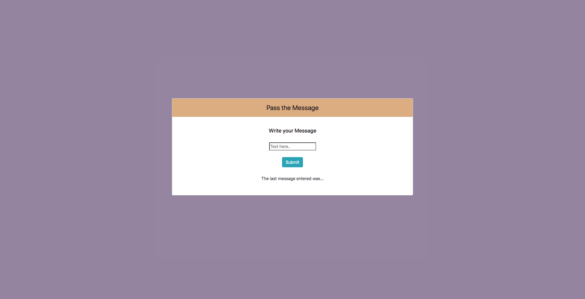

# Pass-the-Message-Project

> A small JavaScript program that allows the user to input a message and see it in an another location on the page.

## Demo

Here's a working live demo of the project: https://julianehiem.github.io/pass-the-message/

## Tech/framework used

- [HTML](https://developer.mozilla.org/en-US/docs/Web/HTML)
- [CSS](https://developer.mozilla.org/en-US/docs/Web/CSS)
- [JS](https://developer.mozilla.org/en-US/docs/Web/JavaScript)

## Links

- Repository:https://github.com/JulianEhiem/background-color-changer/

## License

This project is licensed under the terms of the **MIT** license.

MIT © [JulianEhiem](https://github.com/JulianEhiem)
